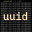
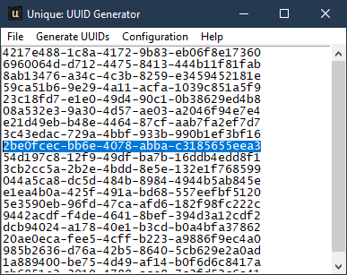
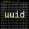

# Unique: UUID Generation (in Python) 
"Unique", the UUID generator tool. ```unique_gui.py``` and ```unique.py``` will generate UUIDs in a variety of flavours. This project builds on code originally developed in 2016; leveraging different python libraries to provide all the uuid related features in a single project. Windows Executables created with pyinstaller 4.0.

>__Note:__ A Version 4 UUID is the default, safe and extremely random output of this tool.

## Features
* Generate UUID Versions 1, 3, 4, 5 and the "Special Nil Case"/0
* Support for DNS (FWDN), URL, OID and X.500 Namespaces (```--ns```)
* Prefix UUID with URN (RFC 4122) (```-u```)
* Commandline Unix-Like tool and Graphical User Interface
* Non-Standard: Output UUID as Uppercase (```-U```)
* Shorten UUIDs using Base64 Encoding (```-s```)
* __Platform Agnostic:__ Python, Docker & Windows

## Background
Back in May 2016, I needed a random number generator and started learning about UUIDs. This tool started as a way to automatically generate 20 v4 UUIDs (the only one not static or engineered to a set of hardware) and has now been updated and released to hopefully demonstrate my profeciency with ```git```, ```git-flow```, ```markdown```, ```python```, ui design, ux design, ```tkinter```, oosd, argument parsing, ```RegEx```, ```Base64```, ```Hexadecimal```, Docker, and more!

## What is a UUID? (from [Wikipedia](https://https://en.wikipedia.org/wiki/Universally_unique_identifier))
A universally unique identifier (UUID) is a 128-bit number used to identify information in computer systems. UUIDs are, for practical purposes, unique. Their uniqueness does not depend on a central registration authority or coordination between the parties generating them. Anyone can create a UUID and use it to identify something with near certainty that the identifier does not duplicate one that has already been, or will be, created to identify something else.

## Further Reading:
* [Base64](https://en.wikipedia.org/wiki/Base64)
* [URN](https://en.wikipedia.org/wiki/Uniform_Resource_Name), [URI](https://en.wikipedia.org/wiki/Uniform_Resource_Identifier) and [URL](https://en.wikipedia.org/wiki/URL)
* [OID / object identifier](https://en.wikipedia.org/wiki/Object_identifier)
* [X.500 Distinguished Names](https://www.ibm.com/support/knowledgecenter/en/SSYKE2_7.0.0/com.ibm.java.security.component.70.doc/security-component/keytoolDocs/x500dnames.html)
* [MAC Address](https://www.ibm.com/support/knowledgecenter/en/SSYKE2_7.0.0/com.ibm.java.security.component.70.doc/security-component/keytoolDocs/x500dnames.html)

# Usage
## Grapphical User Interface (```unique_gui.py```)
Using the ```tkinter``` library, a gui is available to generate UUIDs for those not comfortable with the command line. Simply open/execute ```% python3 unique_gui.py```/```unique-gui.exe``` to be presented with the following grpahical interface:

Windows                  | Linux
-------------------------|---------------
 | <span style="color:red">Work in Progres...</span>

<br>

The following Menu options are availble:
* File
  * __New__: Clear-down the UUIDs in the current tool, ready for new generation
  * __Open__: Open a text (```.txt```) file, useful for appending UUIDs
  * __Save__: Save the current UUIDs to a text (```.txt```) file
  * __Quit__
* Generate
  * __Version 1__: Generare a Version 1 (Datetime & MAC Address) UUID
  * __Version 4__: Generate a Version 4 UUID (based on RNG)
  * ~~__Version 3__: Generate a Version 3 (MD5, Namespace & Name-based) UUID~~ (<span style="color:red">Work in Progres</span>)
  * ~~__Version 5__: Generate a Version 5 (SHA-1, Namespace & Name-based) UUID~~
  * __Special Nil UUID__: Generate a Nil UUID (_0's_) (<span style="color:red">Work in Progres</span>)
* Tools
  * __Options__: Open the Options popup
* Help
  * __About__: Opens a popup window with author/version information
## Command Line / Bash (```unique.py```)
### Summary
The following arguments are compatible with the respective UUID-version generation.
Version | Switch | Specifics                  | Additional Options (__Bold = Mandatory__)
--------|--------|----------------------------|-------------------------------------------
0 / Nil | -v 0   | Special Nil UUID           | -q, -u, -U
1       | -v 1   | Datetime and MAC address   | -q, -u, -U
4       | -v 4   | Random Data                | -q, -u, -U
3       | -v 3   | Namespace & Name-based     | -q, -u, -U, __--ns__, __-n__
5       | -v 5   | Namespace & Name-based     | -q, -u, -U, __--ns__, __-n__

### Usage Examples (Windows)

The following code block uses shorthand arguments, the tool provides the facility to use both short (e.g. ```-q```) and long (e.g. ```--quantity```) arguments interchangebly. Windows can natively execute ```.py``` files if Python is installed. If you are using the independant released exexutable; simply substitute the extensions in the following examples to ```.exe```.

```powershell
# UUIDv4
>./unique.py
27fd1448-3c0d-4d73-94c4-9f16dd9e0c16

# 5 x UUIDv4
>./unique.py -q 5
32ec9ca1-2a84-40c9-afa4-f67a7a8c3156
039ee9f1-c5a0-4d85-805a-89b84974a6c7
b6a4587d-a3de-4e4c-8d84-a3fad6b14192
91bd7bf0-8b6e-46af-ad01-7f91ca66aa25
4085c90e-b195-40fb-b31e-e5faf76eb34a

# 2 x UUIDv1 with URN prefix
>./unique.py -v 1 -q 2 -u
urn:uuid:7ed04b31-f14c-11ea-ac52-e4b31802edf0
urn:uuid:7ed0c3d9-f14c-11ea-aabd-e4b31802edf0

# Special Nil UUID
>./unique.py -q 1 -v 0
00000000-0000-0000-0000-000000000000

# UUIDv5 for "python.org" Fully qualified domain name
>./unique.py -v 5 --ns dns -n "python.org"
886313e1-3b8a-5372-9b90-0c9aee199e5d

# Uppercase UUIDv3 for "http://adambonner.co.uk" URL with URN prefix
>./unique.py -U -v 3 -n "http://adambonner.co.uk" --ns url -u
urn:uuid:1FDC56DF-BB86-3F0D-9356-8612ABA227FF

# Display Help
>./unique.py --help
usage: unique.py [-h] [-v <VERSION>] [-q <QUANTITY>] [--ns <NAMESPACE>] [-n <NAME>] [-u] [-U]

Generate a number of version specific UUIDs.

optional arguments:
  -h, --help            show this help message and exit
  -v <VERSION>, --version <VERSION>
                        Specify output UUID version (0, 1, 3, 4, or 5)
  -q <QUANTITY>, --quantity <QUANTITY>
                        Specify output quanitity (1 - 65536)
  --ns <NAMESPACE>, --namespace <NAMESPACE>
                        UUID v3 or v5 namespace
  -n <NAME>, --name <NAME>
                        Specify UUID v3 or v4 name
  -u, --urn             Specify URN standard prefix
  -U, --uppercase       Non-standard uppercase UUID string
```

### Usage Example (Linux)
<span style="color:red">Work in Progres...</span>

## Docker (```docker run --rm -it uuid:latest```)
The project's Dockerfile can be utilised to create a platform independant container image; supporting the generation of UUIDs in cloud (e.g. Kubernetes/OpenShift) environments.

### Build Docker Image
```bash
#Use Docker to Build Image, you may need elevated privilages/"root"
$ docker build . -t uuid
```
### Run Docker Image (Examples)
```bash
# UUIDv4
$ docker run --rm -it uuid:latest

# 5 x UUIDv4
$ docker run --rm -it uuid:latest -q 5
32ec9ca1-2a84-40c9-afa4-f67a7a8c3156
039ee9f1-c5a0-4d85-805a-89b84974a6c7
b6a4587d-a3de-4e4c-8d84-a3fad6b14192
91bd7bf0-8b6e-46af-ad01-7f91ca66aa25
4085c90e-b195-40fb-b31e-e5faf76eb34a

# Display Help
$ docker run --rm -it uuid:latest --help
```

## Installation / Prerequisites / Dependencies

>__Note:__ The Docker (CLI-only) version of this project is inherently platform independant. This readme doesn't discuss that technology. Get started [here](https://docs.docker.com/get-started/).

```Unique``` is build with utilising the following Python 3 libraries:

* ```uuid```
* ```argparse```
* ```tk``` (_including:_ messagebox, simpledialog)
* ```re```
* ```sys```
* ```logging```
* ```codecs```
* ```pyinstaller```

To utilise ```unique``` on multiple platforms Python 3 is required.

__Windows:__
```powershell
# Install Python3 using Chocolatey
choco install python -y

# Restart Windows Terminal / PowerShell
echo "close this window"

# Use pip to Install PyInstaller
pip install pyinstaller
```

__Linux:__
```bash
# Install Python 3
sudo apt-get install python3

# Install tkinter
?????????????????????????????
```

## Other Software
The following software was used to create this project:
* Graphics and Images created with: [Paint.net](https://www.getpaint.net)
* Windows Icon (```.ico```) file created with: [IcoFX Portable (1.6.4 Rev 3)](https://portableapps.com/apps/graphics_pictures/icofx_portable)
* IDE: [Microsoft Visual Studio Code](https://code.visualstudio.com)

# Miscellaneous

## Project Icon
The following project icon was created with paint.net. Using a screenshot of Powershell executing the creation of 20 Version 1 UUIDs. 4 image resolutions where then produced and compiled into the single compressed ```.ico``` format.

 |  |  | 
------------------|------------------|------------------|-----------------
__256x256:__      | __48x48:__       | __32x32:__       | __16x16:__

## Known Limitations
The following are known limitations and probably wont get fixed. Feel free to raise a pull request if you can help:
* Limited to the 4 predefined UUID v3/v5 namespaces (URL, DNS, OID, X.500)
* Unicode support is untested

## Special Thanks
Thanks to these great projects I was able to figure out how to use tkinter for the GUI.
* [jatinkarthik-tripathy](https://github.com/jatinkarthik-tripathy/Text-Editor)
* [six519](https://github.com/six519/Python-Notepad)
* [code-mentor.org](https://code-mentor.org/notepad-using-tkinter-in-python-with-source-code)

## Roadmap
```Unique``` is a hobby project with no guarantees. I've been thinking about adding the following functionaity somewhere down the line though!:

* ~~Support for more than UUIDv4~~
* ~~Make code more Unix-like (no boilerplate on execution)~~
* ~~Parameterise the number of returned UUIDs~~
* ~~Special Nil UUID~~
* ~~Support for standard UUID URN prefix~~
* ~~Support for non-standard uppercase UUID~~
* ~~Auto-generated help~~
* ~~Redo the Icon~~
* ~~Adding support for uuid namespaces, enabling UUIDv3 and UUIDv5~~
* ~~Add a Graphical User Interface~~
* Enable File Open/Save in the GUI
* Dark mode
* ~~Utilise a tools/options panel/frame/window~~
* Encode UUIDs in Base64 to reduce character length
* ~~Dockerise the commandline tool~~
* Dockerise the GUI (as Web Application?)
* Decode Base64 encoded UUID
* Reverse-Engineer UUID: Version
* Reverse-Engineer UUID: Date/Time
* Reverse-Engineer UUID: MAC Address
