# Unique: UUID Generation (in Python) 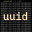
"Unique": the UUID generator tool. ```unique.py``` will generate/decode UUIDs using a CLI, whilst ```unique_gui.py``` wraps this up in a multi-OS GUI. This project in availble as native python source, a windows executable and docker image.

>__Note:__ This project uses git submodules, clone with: ```git clone <link> --recurse-submodules```

## Features
* Generate UUID Versions 1, 3, 4, 5 and the "Special Nil Case"/0 (_GUI 0/1/4 Only_)
* Support for DNS (FQDN), URL, OID and X.500 Namespaces (```--ns```)
* Prefix UUID with URN (RFC 4122) (```-u```)
* Commandline Unix-Like tool and Graphical User Interface
* Non-Standard: Output UUID as Uppercase (```-U```)
* Shorten UUIDs using Base64 Encoding (```-s```)
* Decode UUID with pretty-print or version/type information
* Generation of Unique Lexicographically Sortable Identifiers / [ULIDs](https://github.com/adambonneruk/ulid)
* __Platform Agnostic:__ Python, Docker & Windows

## Background
Back in May 2016, I needed a random number generator and started learning about UUIDs. This tool started as a way to automatically generate 20 v4 UUIDs (the only one not static or engineered to a set of hardware) and has now been updated and released to hopefully demonstrate my profeciency with ```git```, ```git submodule```, ```git-flow```, ```markdown```, ```python```, ui design, ux design, ```tkinter```, oosd, argument parsing, ```RegEx```, ```Base64```, ```Hexadecimal```, Docker, and more!

## What is a UUID? (from [Wikipedia](https://https://en.wikipedia.org/wiki/Universally_unique_identifier))
A universally unique identifier (UUID) is a 128-bit number used to identify information in computer systems. UUIDs are, for practical purposes, unique. Their uniqueness does not depend on a central registration authority or coordination between the parties generating them. Anyone can create a UUID and use it to identify something with near certainty that the identifier does not duplicate one that has already been, or will be, created to identify something else.

>__Note:__ A Version 4 UUID is the default, safe and extremely random output of this tool.

### ...and what is a ULID?
Unique Lexicographically Sortable Identifiers (ULIDs) are; like UUIDs, 128-bit random numbers used to to universally identify data items. With the added benefits of being shorter (26 character Base32-encoded string), sortable (lexigraphically and monotonic) and case insensitive.

## Further Reading:
* [Base64](https://en.wikipedia.org/wiki/Base64)
* [URN](https://en.wikipedia.org/wiki/Uniform_Resource_Name), [URI](https://en.wikipedia.org/wiki/Uniform_Resource_Identifier) and [URL](https://en.wikipedia.org/wiki/URL)
* [OID / object identifier](https://en.wikipedia.org/wiki/Object_identifier)
* [X.500 Distinguished Names](https://www.ibm.com/support/knowledgecenter/en/SSYKE2_7.0.0/com.ibm.java.security.component.70.doc/security-component/keytoolDocs/x500dnames.html)
* [MAC Address](https://www.ibm.com/support/knowledgecenter/en/SSYKE2_7.0.0/com.ibm.java.security.component.70.doc/security-component/keytoolDocs/x500dnames.html)

# Usage
## Graphical User Interface (```unique_gui.py```)
Using the ```tkinter``` library, a gui is available to generate UUIDs for those not comfortable with the command line. Simply open/execute ```python3 unique_gui.py``` to be presented with the following graphical interface:

&nbsp;     | Windows                           | Linux                             | macOS
---------- |-----------------------------------|-----------------------------------|----------------------------------
__Unique__ | 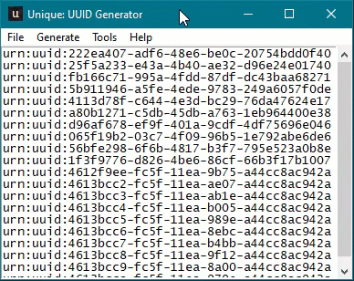         | 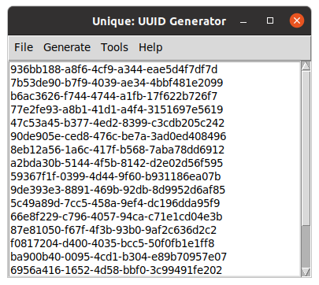         | 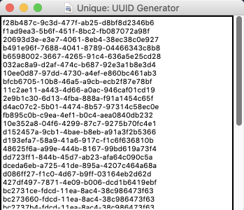
Menu       | 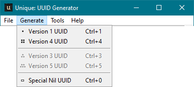    | 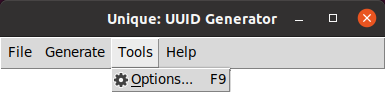    | 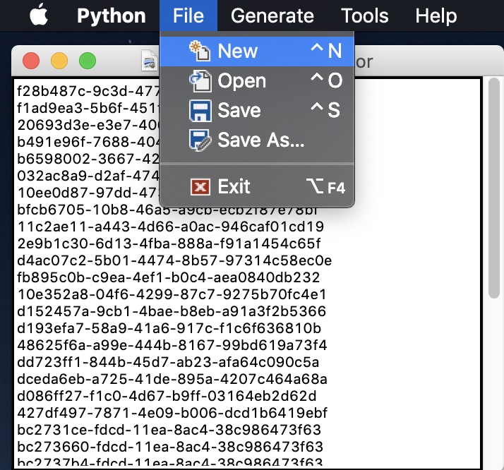
Options    | 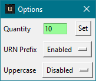 | 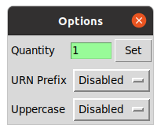 | 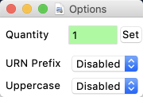
About      | 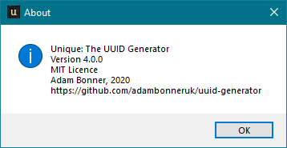   | 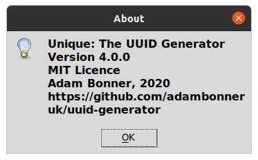   | 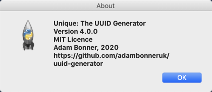

<br>

The following Menu options are availble:
* File
  * __New__: Clear-down the UUIDs in the current tool, ready for new generation
  * __Open__: Open a text (```.txt```/```.uuid```) file, useful for appending UUIDs
  * __Save__: Save the current UUIDs to a text (```.txt```/```.uuid```) file
  * __Save As..__: Save the current UUIDs to a new text (```.txt```/```.uuid```) file
  * __Quit__
* Generate
  * __Version 1 UUID__: Generare a Version 1 (Datetime & MAC Address) UUID
  * __Version 4 UUID__: Generate a Version 4 UUID (based on RNG)
  * __Special Nil UUID__: Generate a Nil UUID (_0's_)
* Tools
  * __Options__: Open the Options popup
* Help
  * __About__: Opens a popup window with author/version information

The following Keyboard Shortcuts are available:
* __CTRL + N__: Clear-down the UUIDs in the current tool,ready for new generation
* __CTRL + O__: Open a text (```.txt```/```.uuid```) file,useful for appending UUIDs
* __CTRL + S__: Save the current UUIDs to a text (```.txt``````.uuid```) file
* __CTRL + 0__: Generate a Nil UUID (_0's_)
* __CTRL + 1__: Generare a Version 1 (Datetime & MAC Address)UUID
* __CTRL + 4__: Generate a Version 4 UUID (based on RNG)
* __F1__: Opens a popup window with author/version information
* __F9__: Open the Options popup
* __ALT + F4__: Exit/Quit

## Command Line / Bash (```unique.py```)
### Summary (Generate)
The following arguments are compatible with the respective UUID-version generation.
Version | Switch | Specifics                  | Additional Options (__Bold = Mandatory__)
--------|--------|----------------------------|-------------------------------------------
0 / Nil | -v 0   | Special Nil UUID           | -q, -u, -U, -s
1       | -v 1   | Datetime and MAC address   | -q, -u, -U, -s
4       | -v 4   | Random Data                | -q, -u, -U, -s
3       | -v 3   | Namespace & Name-based     | __--ns__, __-n__, -q, -u, -U, -s
5       | -v 5   | Namespace & Name-based     | __--ns__, __-n__, -q, -u, -U, -s

### Summary (Decode)
Utilising the ```decode``` positional argument, ```unique``` will instead process/decode a given UUID and pretty print the output as a lowercase, dash-seperated string. The input can be in multiple formats (urn-prefix, hexadecimal, base64 etc.)

Mode   | Argument | Description                  | Additional Options
-------|----------|------------------------------|-------------------------------------------
decode |  &lt;UUID&gt;  | Decode string <UUID> as UUID | -i, --information

### Usage Examples (Windows)
The following code block uses shorthand arguments, the tool provides the facility to use both short (e.g. ```-q```) and long (e.g. ```--quantity```) arguments interchangebly. Windows can natively execute ```.py``` files if Python is installed. If you are using the independant released exexutable; simply substitute the extensions in the following examples to ```.exe```.

```powershell
# UUIDv4
> .\unique.py
27fd1448-3c0d-4d73-94c4-9f16dd9e0c16

# 5 x UUIDv4
> .\unique.py -q 3
32ec9ca1-2a84-40c9-afa4-f67a7a8c3156
039ee9f1-c5a0-4d85-805a-89b84974a6c7
b6a4587d-a3de-4e4c-8d84-a3fad6b14192

# 2 x UUIDv1 with URN prefix
> .\unique.py -v 1 -q 2 -u
urn:uuid:7ed04b31-f14c-11ea-ac52-e4b31802edf0
urn:uuid:7ed0c3d9-f14c-11ea-aabd-e4b31802edf0

# Special Nil UUID
> .\unique.py -q 1 -v 0
00000000-0000-0000-0000-000000000000

# UUIDv5 for "python.org" Fully qualified domain name
> .\unique.py -v 5 --ns dns -n "python.org"
886313e1-3b8a-5372-9b90-0c9aee199e5d

# Uppercase UUIDv3 for "http://adambonner.co.uk" URL
> .\unique.py -U -v 3 -n "http://adambonner.co.uk" --ns url
1FDC56DF-BB86-3F0D-9356-8612ABA227FF

# Decode and Pretty-Print Base64 Encoded UUID
> .\unique.py decode EaLLP0e7R9akp4EC/wyw4w==
11a2cb3f-47bb-47d6-a4a7-8102ff0cb0e3

# Decode Base64 Encoded UUID with verbose information
> .\unique.py decode -i famfC///EeqRY6RMyKyUKg==
Input String:   famfC///EeqRY6RMyKyUKg==
Input Type:     Base64
UUID:           7da99f0b-ffff-11ea-9163-a44cc8ac942a
Version:        1
Description:    Time and Node Based UUID
Namespace:      None
Name:           None
Date & Time:    2020-09-26 13:52:17.823309
MAC Address:    a4-4c-c8-ac-94-2a
Base64:         famfC///EeqRY6RMyKyUKg==
URN Prefix:     urn:uuid:7da99f0b-ffff-11ea-9163-a44cc8ac942a
Hexadecimal:    7da99f0bffff11ea9163a44cc8ac942a
Integer:        167034223496070676450392100360877282346
Uppercase:      7DA99F0B-FFFF-11EA-9163-A44CC8AC942A

# Generate 5xULIDs
> .\unique.py ulid -q 5
01EK645S91Q27M3343C2607VWY
01EK645S92V05X50AGX4BB337R
01EK645S93CTX4SE9TQJ03DQKA
01EK645S936YJ7CPR6ME36G44B
01EK645S9GM5RDNAT1YG6Z8AJV

```
### Usage Example (Linux)
```bash
# UUIDv4
$ python3 unique.py
31c2c13c-60c9-4883-8f12-16ede5022da4

# 3x UUIDv1 encoded as Base64
$ python3 unique.py -v 1 -q 3 --short
EHuMMPxlEeqNuc2jzUq+xw==
EHuMMfxlEeqNuc2jzUq+xw==
EHuMMvxlEeqNuc2jzUq+xw==
```

### Display Help
Using the ```-h``` (```--help```) argument on either Windows or Linux displays the following information:
```
usage: unique.py [-h] [-v <VERSION>] [-q <QUANTITY>] [--ns <NAMESPACE>] [-n <NAME>] [-u | -U | -s] {decode,ulid} ...

Generate or Decode a Universally Unique ID

positional arguments:
  {decode,ulid}              DECODE UUID or GENERATE a ULID

optional arguments:
  -h, --help            show this help message and exit
  -v <VERSION>, --version <VERSION>
                        Specify output UUID version (0, 1, 3, 4, or 5)
  -q <QUANTITY>, --quantity <QUANTITY>
                        Specify output quantity (1 - 65536)
  --ns <NAMESPACE>, --namespace <NAMESPACE>
                        UUID v3 or v5 namespace
  -n <NAME>, --name <NAME>
                        Specify UUID v3 or v5 name
  -u, --urn             Specify URN standard prefix
  -U, --uppercase       Non-standard uppercase UUID string
  -s, --short           Shortened UUID using Base64 Encoding

Unique vX.Y.Z | Adam Bonner | 2020
```

## Docker (```docker run --rm -it uuid:latest```)
The project's Dockerfile can be utilised to create a platform independant container image; supporting the generation of UUIDs in cloud (e.g. Kubernetes/OpenShift) environments. Getting ```unique``` to work with docker requires two steps, first create the docker image, then run it in the docker service

### Build Docker Image
```bash
#Use Docker to Build Image, you may need elevated privilages/"root"
$ docker build . -t uuid
```
### Run Docker Image (Examples)

```bash
# UUIDv4
$ docker run --rm -it uuid:latest

# 5 x UUIDv4
$ docker run --rm -it uuid:latest -q 5
32ec9ca1-2a84-40c9-afa4-f67a7a8c3156
039ee9f1-c5a0-4d85-805a-89b84974a6c7
b6a4587d-a3de-4e4c-8d84-a3fad6b14192
91bd7bf0-8b6e-46af-ad01-7f91ca66aa25
4085c90e-b195-40fb-b31e-e5faf76eb34a

# Display Help
$ docker run --rm -it uuid:latest --help
```

### Ubuntu 20.04 LTS Bash Example
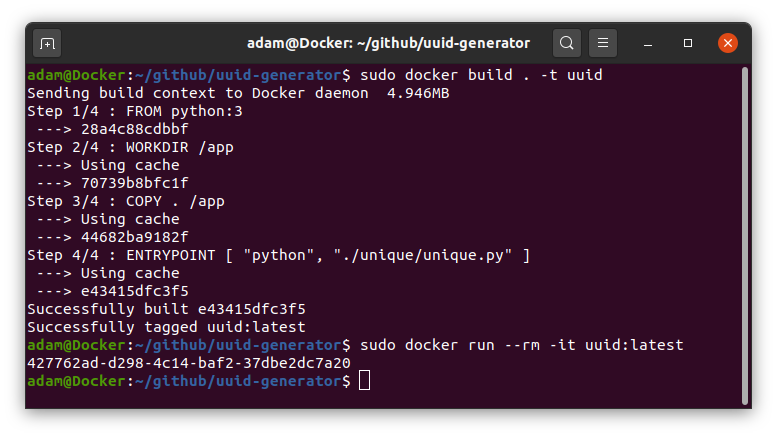

## Installation / Prerequisites / Dependencies

>__Note:__ The Docker (CLI-only) version of this project is inherently platform independant. This readme doesn't discuss that technology. Get started [here](https://docs.docker.com/get-started/).

```Unique``` is build with utilising the following Python 3 libraries:

* ```uuid```
* ```codecs```
* ```re```
* ```argparse```
* ```tk```/```tkinter``` (including: ```messagebox```, ```simpledialog```, ```filedialog```)
* ```logging```
* ```pyinstaller```

To utilise ```unique``` on multiple platforms Python 3 is required.

__Windows:__
```powershell
# Install Python3 using Chocolatey
choco install python -y

# Restart Windows Terminal / PowerShell
echo "close this window"

# Use pip to Install PyInstaller
pip install pyinstaller
```

__Linux:__
```bash
# Install Python 3
sudo apt-get install python3

# Install tkinter
sudo apt-get install python3-tk
```

## Other Software
The following software was used to create this project:
* Graphics and Images created with: [Paint.net](https://www.getpaint.net)
* Microsoft [Visual Studio Image Library](https://www.microsoft.com/en-us/download/details.aspx?id=35825)
* Windows Icon (```.ico```) file created with: [IcoFX Portable (1.6.4 Rev 3)](https://portableapps.com/apps/graphics_pictures/icofx_portable)
* IDE: [Microsoft Visual Studio Code](https://code.visualstudio.com)

# Miscellaneous

## Project Icon
The following project icon was created with paint.net. Using a screenshot of Powershell executing the creation of 20 Version 1 UUIDs. 4 image resolutions where then produced and compiled into the single compressed ```.ico``` format.

 | 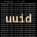 |  | 
-------------------------|-------------------------|-------------------------|------------------------
256x256                  | 48x48                   | 32x32                   | 16x16

## Known Limitations
The following are known limitations and probably wont get fixed. Feel free to raise a pull request if you can help:
* Limited to the 4 predefined UUID v3/v5 namespaces (URL, DNS, OID, X.500)
* Unicode support is untested

## Special Thanks
Thanks to these great projects I was able to figure out how to use tkinter for the GUI.
* [jatinkarthik-tripathy](https://github.com/jatinkarthik-tripathy/Text-Editor)
* [six519](https://github.com/six519/Python-Notepad)
* [code-mentor.org](https://code-mentor.org/notepad-using-tkinter-in-python-with-source-code)

## Roadmap
```Unique``` is a hobby project with no guarantees. I've been thinking about adding the following functionaity somewhere down the line though!:

* ~~```CLI:``` Support for more than UUIDv4~~
* ~~```CLI:``` Make code more Unix-like (no boilerplate on execution)~~
* ~~```CLI:``` Parameterise the number of returned UUIDs~~
* ~~```CLI:``` Special Nil UUID~~
* ~~```CLI:``` Support for standard UUID URN prefix~~
* ~~```CLI:``` Support for non-standard uppercase UUID~~
* ~~```CLI:``` Auto-generated help~~
* ~~Redo the Icon~~
* ~~```CLI:``` Adding support for uuid namespaces, enabling UUIDv3 and UUIDv5~~
* ~~Dockerise the commandline tool~~
* ~~__GUI:__ Add a Graphical User Interface~~
* ~~__GUI:__ Utilise a tools/options panel/frame/window~~
* ~~__GUI:__ Enable File: New/Open/Save/Save As.../Exit in the GUI~~
* ~~__GUI:__ Add Iconography to the Menu Bar~~
* ~~__GUI:__ Enable Keyboard Shortcuts in the GUI~~
* __GUI:__ Highlight Current Line
* __GUI:__ Highlight Regex Version
* __GUI:__ Add (floating?) File Information Pane
* __GUI:__ Add UUIDv3 and UUIDv5
* __GUI:__ Dark Mode
* __GUI:__ Dockerise the GUI (as Web Application?)
* ~~```CLI:``` Encode UUIDs in Base64 to reduce character length~~
* ~~```CLI:``` Decode Base64 encoded UUID~~
* ~~```CLI:``` Reverse-Engineer UUID: Version~~
* ~~```CLI:``` Reverse-Engineer UUID: Date/Time~~
* ~~```CLI:``` Reverse-Engineer UUID: MAC Address~~
* __GUI:__ Encode UUIDs in Base64 to reduce character length
* __GUI:__ Decode Base64 encoded UUID
* __GUI:__ Reverse-Engineer UUID: Version
* __GUI:__ Reverse-Engineer UUID: Date/Time
* __GUI:__ Reverse-Engineer UUID: MAC Address
* Creating a Windows Installer
* ~~```CLI:``` Generate a ULID~~
* ```CLI:``` Decode a ULID
* __GUI:__ Generate a ULID
* __GUI:__ Decode a ULID
